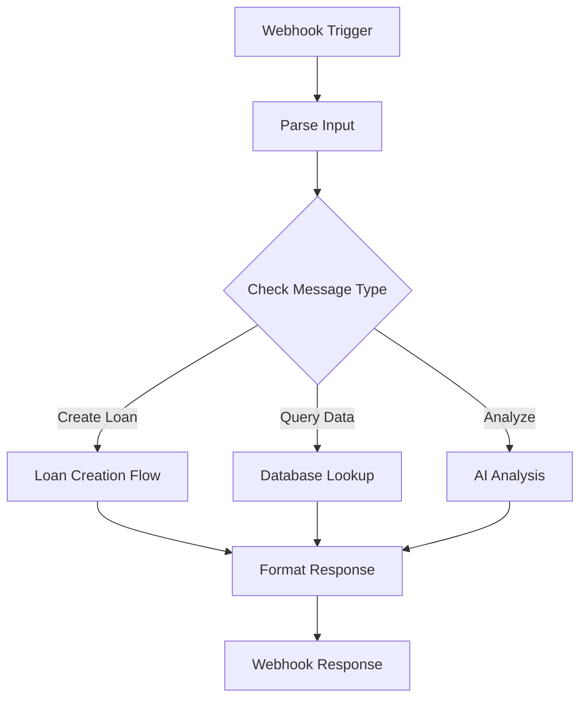

# N8N Workflow Setup Guide for Mkopo Chat Agent

This guide helps you set up the n8n webhook to integrate with the Mkopo chat interface.

## Quick Start

### 1. Create Webhook Node in N8N

**Node Type**: Webhook  
**HTTP Method**: POST  
**URL Path**: `/webhook/chat-agent`  
**Authentication**: None (for development)

**Webhook URL** (after setup):
```
http://your-n8n-instance:5678/webhook/chat-agent
```

---

## Workflow Structure



---

## Example Workflows

### Basic Echo Workflow (Testing)

```json
{
  "nodes": [
    {
      "parameters": {
        "path": "chat-agent",
        "responseMode": "onReceived",
        "responseData": "={{ $json.body }}"
      },
      "name": "Webhook",
      "type": "n8n-nodes-base.webhook",
      "typeVersion": 1,
      "position": [250, 300]
    },
    {
      "parameters": {
        "jsCode": "return {\n  success: true,\n  response: `Echo: ${$input.all()[0].json.body.message}`,\n  thinking: 'Simple echo to test connectivity'\n};"
      },
      "name": "Code",
      "type": "n8n-nodes-base.code",
      "typeVersion": 2,
      "position": [450, 300]
    },
    {
      "parameters": {
        "respondWith": "lastNode"
      },
      "name": "Respond to Webhook",
      "type": "n8n-nodes-base.respondToWebhook",
      "typeVersion": 1,
      "position": [650, 300]
    }
  ],
  "connections": {
    "Webhook": {
      "main": [
        [
          {
            "node": "Code",
            "type": "main",
            "index": 0
          }
        ]
      ]
    },
    "Code": {
      "main": [
        [
          {
            "node": "Respond to Webhook",
            "type": "main",
            "index": 0
          }
        ]
      ]
    }
  }
}
```

### Intent Recognition Workflow (Recommended)

**Features**: 
- Parses user intent
- Routes to appropriate action
- Returns suggested next steps

**Nodes**:

1. **Webhook Trigger**
   - Path: `/webhook/chat-agent`
   - Method: POST

2. **Code Node** - Parse Intent
```javascript
const message = $input.first().json.body.message.toLowerCase();

let intent = 'unknown';
let confidence = 0;

// Loan Intent
if (message.includes('loan') && (message.includes('create') || message.includes('new'))) {
  intent = 'create_loan';
  confidence = 0.95;
} else if (message.includes('loan') && (message.includes('pending') || message.includes('list'))) {
  intent = 'list_loans';
  confidence = 0.9;
} else if (message.includes('customer')) {
  intent = 'customer_query';
  confidence = 0.85;
} else if (message.includes('analyze') || message.includes('metric')) {
  intent = 'analytics';
  confidence = 0.8;
}

return {
  intent,
  confidence,
  originalMessage: $input.first().json.body.message,
  context: $input.first().json.body.context
};
```

3. **Switch Node** - Route by Intent
- Condition 1: `intent == "create_loan"` → Loan Creation Flow
- Condition 2: `intent == "list_loans"` → Query Flow
- Condition 3: `intent == "customer_query"` → Customer Flow
- Default: → Generic Response Flow

4. **Generic Response Node**
```javascript
return {
  success: true,
  response: `I understood you're asking about: ${$json.originalMessage}\n\nPossible actions:\n- Create a new loan\n- View pending applications\n- Analyze loan metrics\n- Check customer info`,
  thinking: `Intent: ${$json.intent} (confidence: ${$json.confidence.toFixed(2)})`,
  actions: [
    { type: 'list', data: { items: ['View Loans', 'Create Loan', 'Check Customers'] } }
  ]
};
```

---

## Loan Creation Flow

Route: `create_loan`

**Nodes**:

1. **Extract Customer Info**
```javascript
const context = $json.context;
const message = $json.originalMessage;

// Try to parse customer name from message
const nameMatch = message.match(/for\s+([A-Za-z\s]+)/i);
const name = nameMatch ? nameMatch[1].trim() : null;

return {
  customerName: name,
  userId: context.userId,
  page: context.page,
  timestamp: context.timestamp
};
```

2. **Query Database** (if customer exists)
```
HTTP Request to Backend:
GET http://localhost:8000/api/customers/?search={{$json.customerName}}
```

3. **Generate Response**
```javascript
const customer = $json.length > 0 ? $json[0] : null;

if (customer) {
  return {
    success: true,
    response: `I found customer ${customer.name}! I'm ready to create a loan. What's the loan amount and purpose?`,
    thinking: `Customer ${customer.id} found. Ready to proceed with loan creation.`,
    actions: [
      {
        type: 'navigate',
        data: { 
          url: '/loans/new',
          prefill: { customerId: customer.id }
        }
      }
    ]
  };
} else {
  return {
    success: true,
    response: `I couldn't find a customer with that name. Would you like me to create a new customer first, or search differently?`,
    thinking: 'Customer not found. Need to create new or search.',
    actions: [
      { type: 'navigate', data: { url: '/customers/new' } }
    ]
  };
}
```

---

## Analytics Flow

Route: `analytics`

**Nodes**:

1. **Query Analytics Data**
```
HTTP Request to Backend:
GET http://localhost:8000/api/analytics/summary/
```

2. **Format Analytics Response**
```javascript
const data = $json;

return {
  success: true,
  response: `Here are the key metrics:\n\n📊 Total Loans: ${data.totalLoans}\n💰 Total Disbursed: KES ${data.totalDisbursed}\n✅ Approved: ${data.approvedCount}\n⏳ Pending: ${data.pendingCount}\n❌ Rejected: ${data.rejectedCount}`,
  thinking: 'Compiled analytics from database',
  actions: [
    { type: 'navigate', data: { url: '/dashboard' } }
  ]
};
```

---

## OpenAI Integration (Advanced)

**Prerequisites**: OpenAI API key in n8n

```javascript
// Use OpenAI for smart responses
// This is more advanced - requires OpenAI node setup

const systemPrompt = `You are an AI assistant for a Kenyan loan management platform called Mkopo. 
You help users manage loans, customers, and get analytics.
Be helpful, professional, and concise.
Current context: ${JSON.stringify($json.context)}`;

// Use OpenAI node with:
// Model: gpt-4 or gpt-3.5-turbo
// System Prompt: [as above]
// User Message: {{ $json.originalMessage }}
```

---

## Error Handling

**Add to all workflows**:

```javascript
try {
  // Your workflow logic
  return result;
} catch (error) {
  return {
    success: false,
    error: error.message,
    response: 'An error occurred processing your request. Please try again.'
  };
}
```

---

## Testing Webhook

### Using CURL

```bash
curl -X POST http://localhost:5678/webhook/chat-agent \
  -H "Content-Type: application/json" \
  -d '{
    "message": "Create a new loan for John Doe",
    "context": {
      "page": "/loans",
      "userId": "user123",
      "timestamp": "'$(date -u +'%Y-%m-%dT%H:%M:%SZ')'",
      "metadata": {}
    }
  }'
```

### Using VS Code REST Client

Create `test.http`:

```http
POST http://localhost:5678/webhook/chat-agent
Content-Type: application/json

{
  "message": "Create a new loan for John Doe",
  "context": {
    "page": "/loans",
    "userId": "user123",
    "timestamp": "2026-03-28T10:30:00Z",
    "metadata": {}
  }
}
```

Click "Send Request" in VS Code.

### Frontend Testing

1. Start frontend: `npm run dev`
2. Click Monopoly avatar
3. Type in chat input
4. Check DevTools Network tab for request
5. Verify response appears in chat

---

## Production Checklist

- [ ] Configure authentication for webhook (API key, JWT)
- [ ] Add rate limiting to prevent abuse
- [ ] Implement request validation schema
- [ ] Add logging for all requests/responses
- [ ] Set up error alerts
- [ ] Test timeout handling (30s limit from frontend)
- [ ] Implement caching for common queries
- [ ] Add monitoring for webhook health
- [ ] Document all intent types and workflows
- [ ] Set up backup n8n instance

---

## Common Issues

### Webhook not triggering

**Check**:
1. N8N status: `http://localhost:5678`
2. Webhook path is exact: `/webhook/chat-agent`
3. HTTP method is POST
4. Firewall allows request
5. N8N logs show incoming request

**Fix**: Restart n8n workflow

### Timeout errors (30s limit)

**Optimize**:
- Reduce database query complexity
- Implement caching layer
- Use batch operations
- Add request timeout in n8n nodes
- Profile slow operations

### Large response times

**Solutions**:
- Implement async job processing
- Return quick response + background processing
- Use webhooks for long-running tasks
- Add message queueing (Redis)

### Memory issues with large workflows

**Improve**:
- Break into smaller workflows
- Use sub-workflow calls
- Stream large data responses
- Implement pagination
- Archive old logs

---

## Performance Tips

1. **Database Queries**
   - Use indexes on frequently queried fields
   - Limit result sets with LIMIT/OFFSET
   - Use select specific fields

2. **API Calls**
   - Implement request caching
   - Batch multiple requests
   - Use connection pooling

3. **N8N Optimization**
   - Keep workflows focused
   - Avoid unnecessary data transforms
   - Use batch operations
   - Monitor execution logs

4. **Response Format**
   - Keep responses under 10KB if possible
   - Paginate large data sets
   - Use summaries then drill-down

---

## Next Steps

1. Create webhook node with path `/webhook/chat-agent`
2. Add simple echo workflow for testing
3. Implement intent recognition
4. Build routing logic for different intents
5. Connect to your backend API
6. Add authentication layer
7. Monitor and optimize performance
8. Deploy to production

Good luck! 🚀
